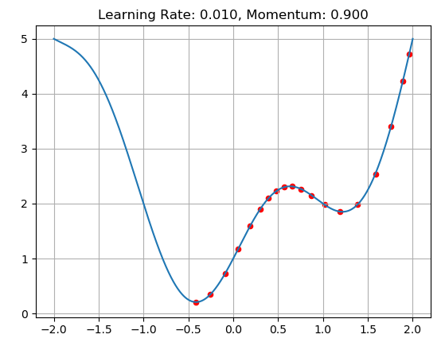

# Class Examples

You can change the learning rate and momentum accordingly  
Loss vs weight is 1D and the function is x^2 + sin(np.pi * x) + 1 this function can be changed for different examples  
To start the simulation select x_point by clicking on the figure  

## To-Do List

Add start and stop marker to figure
