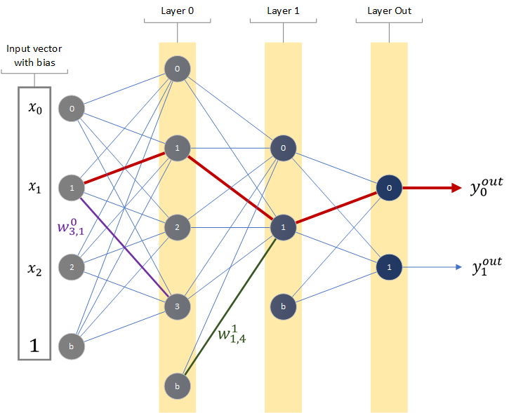

# Multi Layer Perceptron

Warning: Some mathematical representations somehow preivewed wrongly (vectors and matrices).
For the codes and theory, refer to jupyter notebook mlp_theory.ipynb  
For the IRIS dataset solution please refer to mlp_theory_iris.ipynb  
For the class code refer to mlp.py  
For the torch solution refer to mlp_torch.py  

IRIS dataset is downloaded from <https://archive.ics.uci.edu/ml/datasets/iris>.

## To-Do List

* Batch processing can be added to jupyter notebooks
* Momentum can be implemented in notebooks

