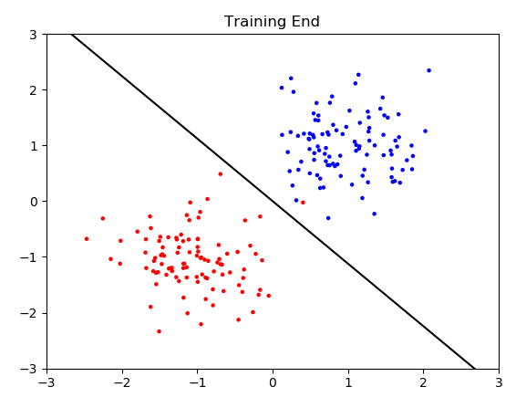
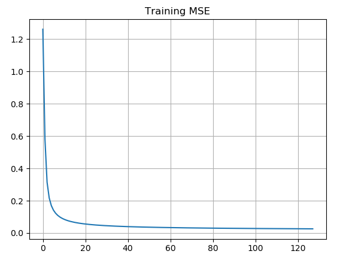

# Perceptron Code

Example code is written for two dimensional data, change accordingly
Tanh is selected as default, if you change beware of class (-1, 1) or (0, 1)  
Figures are created from numpy based perceptron, results can be generated for torch  
For the torch code most important thing is torch has custom data type called torch tensor  
Also torch natively built on batch processing, data has to be given in one by one  

## To-Do List

Add batch training  
Add momentum  
Insert training inside the perceptron
